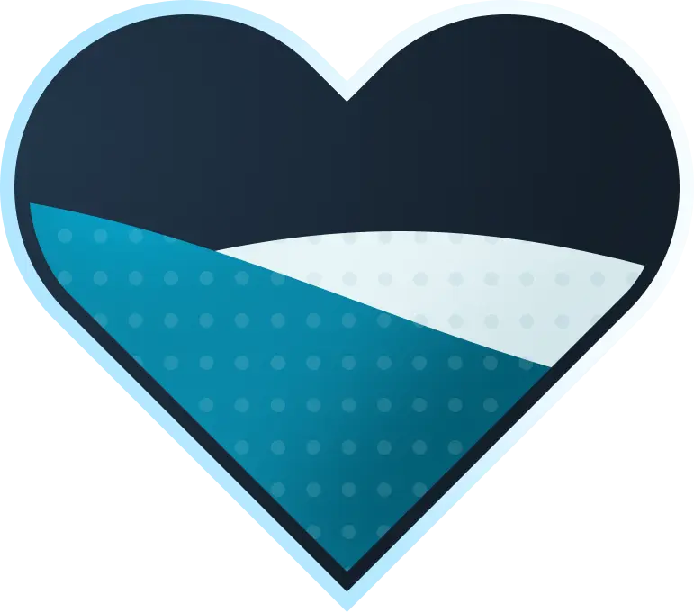

# Виджет (Donation Goal)

> Он же **донейшн-гоал**.\
> Именно **donation goal**, потому что его так обзывают DonationAlerts.

Для понимания всех деталей и чувств кодера, который будет страдать над
вашим дизайном, советую прочесть все из этого раздела.

<h2 id="design">Дизайн</h2>

Никто вас не ограничивает в выборе программы для создания гоала,
но, как факт, в Figma их делать удобно чисто из-за работы с векторами.

> [!TIP]
> Совместно с просмотром гайда рекомендую посмотреть [драфт фигмы](./example.fig)
> для более детального разбора.

---

Как пример - сделаем сердечко с заполнением с помощью двух волн:
синей (основной) и белой (побочной, которая будет позади).

Делаем само сердечко - фон, который будет служить и обводкой,
и "филлером" пустой области. Для такого простого гоала - такого точно
будет достаточно.

Также делаем текстуру для волны. Здесь я постарался учесть
свет сердечка и, во избежание большей работы в коде, прикрепил тень со светом
прямо к текстуре.
> [!IMPORTANT]
> Текстура должна покрывать всю область гоала.


Далее переходим к маскам. Тут нам нужно их две:

1. Маска в виде сердца. Она должна быть меньше фона, чтобы текстура
2. Маска волны. Она должна перекрывать всю область сердца, иметь запас
   по ширине, а конец должен совпадать с началом (чтобы не было
   ощущения дерганости анимации)


Чтобы посмотреть, как все будет выглядеть - смотрим в фигме,
примеряя волны с помощью встроенных масок.



Результат устраивает? Отдаем на код.

> [!TIP]
> Каждый из элементов лучше всего экспортировать в **SVG** или **PNG**
> формате во избежание потери качества.

<h2 id="code">Код</h2>

[/scripts/js/donationalerts.js](/scripts/js/donationalerts.js) уже поддерживает
все нужные функции для подписки на событие изменения Goal'а:
`DonationAlerts::subscribeGoal`.

Все, что вам нужно - регистрировать и обрабатывать этот ивент при
загрузке виджета. Дополнительно можно добавить инициализацию подгрузку
начальных данных.

```js
let lastRaisedAmount = 0;
let goalId = "1234567";

window.addEventListener("onWidgetLoad", async (initData) => {
   const widgetSettings = initData.detail.fieldData;
   const widgetUrl = widgetSettings["daWidgetUrl"];
   
   const userToken = extractToken(widgetUrl);
   goalId = extractGoalId(widgetUrl);
    
   const donationAlerts = new DonationAlerts(userToken);
   await donationAlerts.init();
   
   const initialGoalData = await donationAlerts.getGoalData(goalId);
   onGoal(initialGoalData);
   donationAlerts.subscribeGoals(onGoal);
});

const onGoal = (data) => {
   if (data.id !== goalId || data.raised_amount === lastRaisedAmount) {
      return;
   }
   this.lastRaisedAmount = data.raised_amount;

   animateChanges(data);
}

const animateChanges = (data) => {
   const newPercent = Math.min(data.raised_amount / data.goal_amount, 1);
   $(".goal").css("--goal-fill", `${newPercent}`); // Браузер сам анимирует, если стоит transition
}
```

Это практически конец всего кода именно по части JavaScript'а.
Дополнительно вам нужно будет

Для обрезки гоала стоит использовать маски (как для сердца, так и для волны),
которые подготовили в дизайне. Это можно делать с помощью свойств `mask`
и `-webkit-mask`.

Здесь же добавим `transition` для плавного изменения высоты и положения.

```css
body {
   --goal-fill: 0;
   --mask-image: url("data:image/png;base64,...");
}

.goal {
   .inside {
      mask: var(--mask-image);
      -webkit-mask: var(--mask-image);

      .wave {
         width: 100%;
         height: calc(var(--goal-fill) * 500px);
         top: calc(400px - var(--goal-fill) * 500px);
         transition: height 0.5s ease-in-out, top 0.5s ease-in-out;
      }
   }
}
```

Остальное дописываем ручками сами.\
Вы справитесь, если еще не бросили эту затею после [начала работы с виджетами](/guides/widget)!
