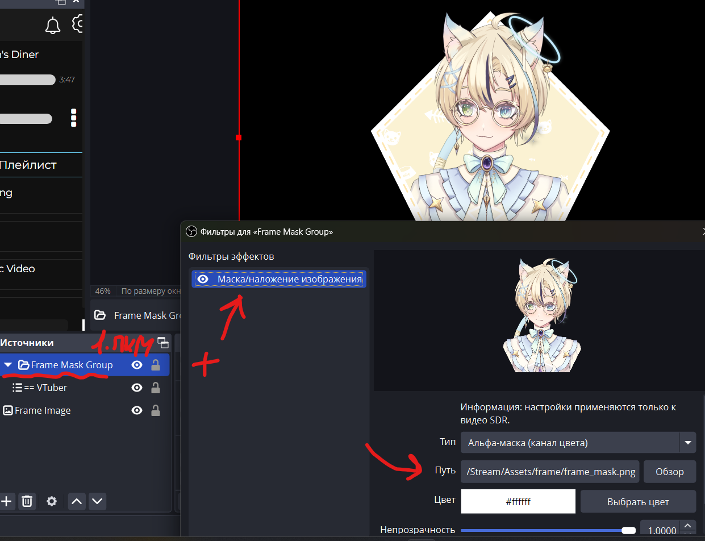

### Подготовка проекта и советы

Убедитесь, что ваш проект сделан под удобство заказчика:
создайте проект 16:9 / 21:9 и экспортируйте изображения в полный размер
холста проекта, чтобы избежать проблем с лишним тыканием положения рамки
в OBS.

### Рамка

Первым делом реализуем рамку. Она может быть любого стиля,
который вам только заблагорассудится. Я сделал себе вот такое вот:

Да, она должна быть без фона как такового, чтобы избежать использования
кривого хромакея или что-то типа того.

> Если у вас какая-то рамка строгой формы, то рекомендую располагать
> точки вектора по целым, чтобы не было лишней возни с маской.

### Маска

Чтобы наш персонаж влезал именно в рамку, нам нужно сделать
маску под эту рамку.\
Маска делается из двух цветов: черный - где нам нужно обрезать персонажа,
и белый - где нужно показывать персонажа.

Обычно делается это с запасом свободного пространства сверху.

> Если у вас какая-то вычурная рамка, рекомендую добавить размытия на стыке
> цветов черного с белым.

### Применение в OBS

Рекомендую создать отдельную сцену и начать настройку там.

Первым делом добавляем рамку как изображение. Кидаем в самый низ.

Потом создаем группу, в которую добавляем захват вашей модельки.
> Создание именно группы нужно для того, чтобы нарезка применялась
> именно на сцену с рамкой и не применялась всегда!

ПКМ по группе -> Свойства -> Плюсик снизу -> Добавить ->
Маска/Наложение изображения.\
И просто указываем путь до файла с маской.

#### Все готово!

Вы можете таскать эту сцену как вам угодно.

